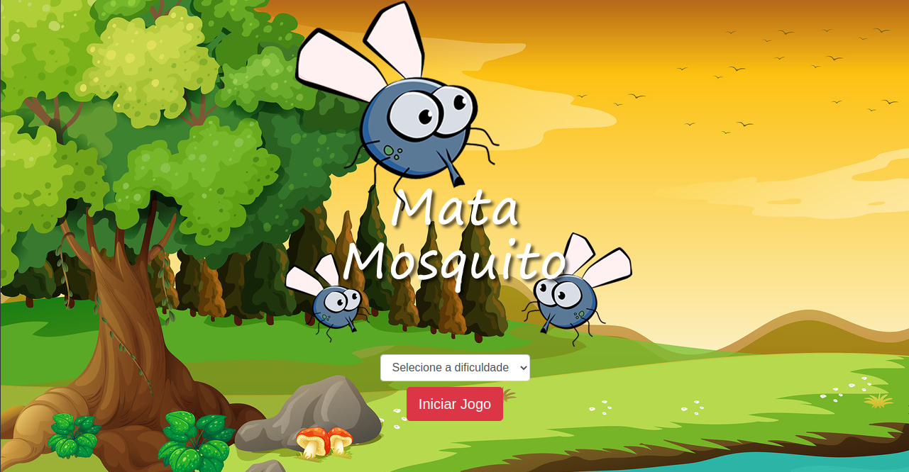

<h1 align="center">Mata Mosquito Game</h1>

	O projeto consiste num simples jogo criado utilizando HTML, CSS e JavaScript com o objetivo de colocar em prática o conhecimento adquirido nas respectivas tecnologias, principalmente em JavaScript. Além desse, outro objetivo é praticar a escrita do README. 

